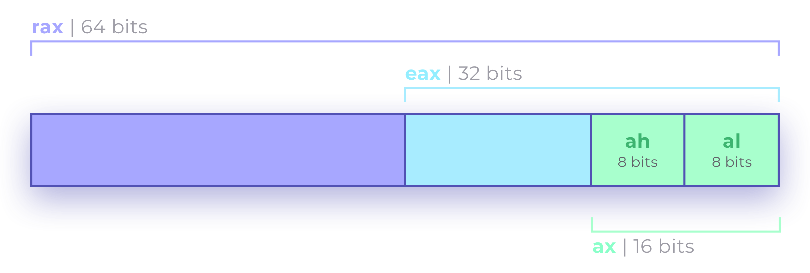

# libASM

Writing a lib in x64 assembly (intel flavour)

## INTRODUCTION 🤓

Sujet → [EN](https://github.com/tinaserra/libASM/blob/master/links/libasm_en.pdf) | [FR](https://github.com/tinaserra/libASM/blob/master/links/libasm_fr.pdf)

### L'assembleur, c'est quoi

C'est un ensemble de langages de programmation qui sont spécifiques à l'architechture de notre processeur. On peut dire qu'il y a autant d'assembleur que d'architechtures.

```js
Expmples : mips - armv7 - x86 - x86-64 ou x64
```

### Pourquoi apprendre l'assembleur en 2021

Pour mieux connaitre son ordinateur et son foctionnement. Également pour reverse des programmes.

### Syntaxes

On a deux syntaxes en asm :

* At&t : instruction $0x1, %eax (source, destination)
* Intel : instruction eax, 0x1  (destination, source)

[Comprende l'assembleur](https://beta.hackndo.com/assembly-basics/)

## STRUCTURE 🦄

### 1. Segements

Les **segements** sont des sortes de boites dans les quelles on va mettre des **valeurs** ou des **instructions**. Le programme nasm ira chercher dans ces segments les valers dont il connait la nature.

```.bss``` = variables non initialisées : ```int a = 0;```</br>
```.data``` = variables initialisées : ```int a = 1;```</br>
```.text``` = code executable : ```printf("%d", a);```

Pour déclarer un segment on utilise le mot clé ```section```

```s
section .bss
    a resb 256

section .data
    hello db `hello world\n`
    hello_len equ $-hello

section .text
    global _main
```

⚠️ Segments ≠ Sections ⚠️

```s
.section DATA, data
; DATA est un segment, data est une section
```

### 2. Registres

Les **registres** sont des petits éléments de stockage, utilisés lors d'un programme, ayants une fonction particulière.</br>

En c, faire un ```int a = 0; a = 1;``` veut dire mettre ```1``` dans la variable ```a```.</br>
En asm, cela revient à prendre une variable non initialisée, auparavant mettre une valeur dans un registre, puis mettre ce registre dans la variable.

#### Shéma d'un registre



Tous les registres ont une fonction pré-définie :

```s
ax → Eax (extended ax) → rax ; Accumulateur (ex : opérations mathématiques)
bx → Ebx → rbx ; Base
cx → Ecx → rcx ; Counter
dx → Edx → rdx ; Data
si → Esi → rsi ; Source
di → Edi → rdi ; Destination
sp → Esp → rsp ; Stack Pointer
bp → Ebp → rbp ; stack Base Pointer
ip → Eip → rip ; Instruction Pointer
```

### 3. Instructions

Une instruction est exécutée lors de l'exécution. Une instruction x86 peut avoir de zéro à trois opérandes.</br>
Voir la [liste complète des instructions x86](https://c9x.me/x86/)

#### Quelques instructions notables

```s
instruction destination, source, last
```

|Instruction|Ce que fait l'instruction|
| :--- | :--- |
|```NOP```|L'instruction NOP à un octet est couramment utilisée pour aligner la mémoire pour accélérer le saut car il est plus rapide de sauter en utilisant des puissances de 2|
|```push```|Met une **valeur** contenue dans un registre sur la stack et décrémente automatiquement ```rsp``` de **sizeof(valeur)**|
|```pop```|Éjecte **valeur** de la stack dans un registre et incrémente automatiquement ```rsp``` de **sizeof(valeur)**|
|```syscall```|Fais de la puissante magie avec le kernel|
|```call```|Met ```rip``` sur la stack et va a ```destination```|
|```leave```|Libère le stack frame actuel. Déplace ```rbp``` vers ```rsp``` et fait apparaître ```rbp``` de la stack|
|```ret```|Renvoie le ```rip``` enregistré par ```call``` dans ```rip```|
|```mov```|Déplace la valeur de ```source``` dans ```destination```|
|```lea```|Charge l'adresse effective de ```source``` dans ```destination```. ```source``` est une adresse mémoire (partie offset) spécifiée avec l'un des modes d'adressage des processeurs, ```destination``` est un registre à usage général|
|```jump```|Charge le ```destination``` dans ```rip```, ```destination``` spécifie l'adresse de l'instruction à laquelle le saut est effectué. ```destination``` peut être une valeur immédiate, un registre à usage général ou un emplacement mémoire|
|```and```|Effectue l'opération suivante: ```destination = destination & source``` et définit quelques indicateurs|
|```test```|Essentiellement une instruction ```and``` qui ne modifie pas ```destination```|
|```rep```|Répète les opérations de chaîne: répète une instruction de chaîne le nombre de fois spécifié dans le registre de comptage ```rcx```. ```rep``` (répéter), ```repe``` (répéter tant que ==), ```repne``` (répéter tant que !=), ```repz``` (répéter jusqu'à zéro ), et ```repnz``` (répéter tant que != 0)|

## LA STACK 👀

### C koi

* La **stack** est une structure mémoire **constante**.
* On peut **stocker des valeurs** sur la stack qui ne changent pas entre les exécutions (contrairement à d'autres structures comme la heap).
* On la manipule grâce à ```rsp``` et ```rbp```.
* De la même manière qu'on peut mettre des valeurs sur la stack on peut aussi les **enlever**.

```rsp``` → pointe vers la derniere valeur empilée sur la stack (addr basses)</br>
```rbp``` → pointe vers la base de la stack (addr hautes), sert de référence pour les fonctions</br>

### Manipuler la stack

Quand on stock ```valeur 1```, puis ```valeur 2```, ```valeur 3```... sur la stack (on les empile).</br>
Il faut savoir que ***sur la stack tout est inversé***, les adresses hautes sont en bas de la pile et les adresses basses sont en haut.</br>
Donc entre l'adresse de ```valeur 1``` et ```valeur 2``` on a **soustré 8** et non ajouté. On soustrait **8** car on code en 64 bits ```x86_64``` (car 8 octets dans 64 bits), si on code en 32 bits on doit soustraire 4 bits (car 4 octet dans 32 bits) et utiliser les registres ```ebp``` et ```esp```.</br>
```rsp``` le stack pointer, pointant vers le haut de la pile il faudra donc lui ajouter 8 pour acceder à la valeur en dessous de lui.

```s
;    ADDR BASSES 0x000000
;    Haut de la pile

;    valeur 5 [rsp]
;    valeur 4 [rsp+8]
;    valeur 3 [rsp+16]
;    valeur 2 [rsp+24]
;    valeur 1 [rsp+32]
    .
    .
    .
;    [rbp]

;    Bas de la pile
;    ADDR HAUTES 0xffffff
```

👑 [Devenir the ultimate master de la stack ou juste la comprendre](https://beta.hackndo.com/stack-introduction/)

## BESTS PRACTICES

### Les define

```s
; On comprend pas ❌
mov rax, 0x02000004

; DEFINE ✅
%define WRITE 0x02000004

mov rax, WRITE
```

### Opti : Assigner zéro à un registre

La façon normale d'assigner demande de déplacer la valeur zéro dans un registre en utilisant l'instruction MOV. Cette méthode est lente puisque le processeur va chercher la valeur zéro en mémoire avant de l'écrire au registre. Le truc est d'utiliser l'instruction XOR sur un seul registre puisque un XOR sur une même valeur est toujours égal à zéro.

```s
; MOV ❌
mov rax, 0

; XOR ✅
xor rax, rax
```

### Opti : Instruction LEA au lieu de MOV déréférencé

Lorsqu'on veut passer l'adresse mémoire d'une variable, il semble évident de simplement utiliser MOV sur une variable déréférencer. L'instruction LEA permet de faire la même chose sans avoir à passer par l'étape de déréférencement en copie l'adresse directement.

```s
; MOV ❌
mov rax, variable

; LEA ✅
lea rax, variable
```

### Opti : Utilisation de la soustraction pour les boucles

Dans une boucle, on a un compteur qui est comparé à chaque itération à une valeur désirée. En utilisant un compteur partant d'un nombre positif qui descend jusqu'à zéro, on peut se servir de l'état du drapeau zéro lors de l'instruction SUB et ainsi éviter une comparaison inutile.

```s
; CMP ❌
add rcx, 1
cmp rcx, valeur_désirée
jnz début_boucle

; SUB ✅
sub rcx, 1
jnz début_boucle
```

## USEFUL LINKS 🤙🏼

* Sum up in english by [anselm](https://github.com/grumbach/libftASM)
* [Comprende la stack](https://beta.hackndo.com/stack-introduction/)
* [Comprende l'assembleur](https://beta.hackndo.com/assembly-basics/)
* Essaye le [Compiler explorer](https://godbolt.org/)
* Voir la [liste complète des instructions x86](https://c9x.me/x86/)
* Un petit [cours d'assembleur](http://www.lacl.fr/tan/asm)
* Syscalls [linux](https://syscalls.w3challs.com/?arch=x86_64)
* liste des [Jump if Condition Is Met](http://faydoc.tripod.com/cpu/jne.htm)
* [Tricks optimisation](https://www.jeuxvideo.com/forums/42-47-41622456-1-0-1-0-asm-trucs-d-optimisation.htm)
